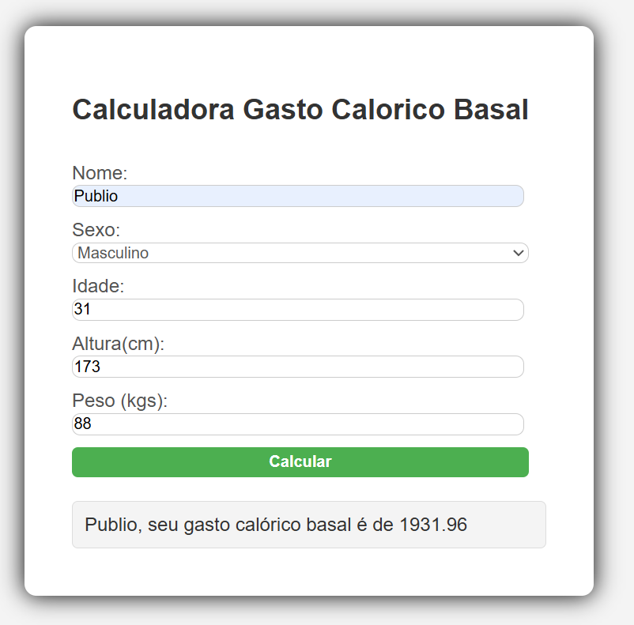

# basal-metabolic-rate-form

# 🧮 Basal Metabolic Rate (BMR) Calculator

This is a simple calculator designed to estimate your **Basal Metabolic Rate (BMR)** using the Harris-Benedict equation. It was built using **HTML**, **CSS**, and **pure JavaScript** (vanilla JS).

## 🎯 Purpose

This was the **first project I developed completely on my own**, with the goal of:

- Practicing programming logic.
- Learning how to manipulate the DOM using JavaScript.
- Creating basic form validations.
- Understanding the full flow of an interactive form in the browser.

## 🧠 How It Works

The user inputs the following data:

- Name
- Gender (Male/Female)
- Age
- Height (in cm)
- Weight (in kg)

Based on this information, the system calculates the BMR using the following formulas:

### Harris-Benedict Equations

- **Male:**  
  `BMR = 66.47 + (13.75 × weight) + (5.003 × height) − (6.775 × age)`

- **Female:**  
  `BMR = 655.1 + (9.563 × weight) + (1.85 × height) − (4.676 × age)`

The result is then displayed directly on the screen after form submission.

## 🖥️ Technologies Used

- HTML5
- CSS3
- JavaScript (Vanilla)

## 📸 Screenshot



## 🚀 How to Run

1. Clone the repository:
   ```bash
   git clone https://github.com/PublioMello/basal-metabolic-rate-form.git
   ```
